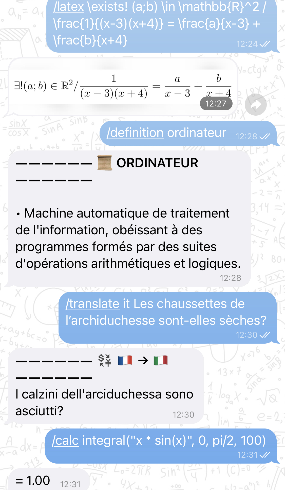

<div align="center">
    
    <h3>Personal Telegram bot for education</h3>
    <a href="https://t.me/ParcolarBot">Add the bot</a> — <a href="./LICENSE">License</a>
</div>

## 🌈 Features

- Fetch homework and timetable for the coming days directly from PRONOTE (French software for school life)
- Do some maths: calculating, plotting, LaTeX rendering
- Search data over educational establishments (Parcoursup), translations of words and sentences, word definitions in the dictionary



## 💻 Development

First, check the following requirements:

- Git, for version control
- Golang 1.15 or higher with go-modules for dependencies
- A running instance of [Redis](https://redis.io/) v5 or higher
- ~~A running instance of [pronote-api](https://github.com/Litarvan/pronote-api) for PRONOTE-related commands~~ Unfortunately, due to legal restrictions in France, PRONOTE can't be used any more through their API
- [TeX Live](https://www.tug.org/texlive/acquire-netinstall.html) for the `pdflatex` program (with default LaTeX packages)
- [ImageMagick](https://imagemagick.org/index.php) for the `convert` program

Clone the project on your local machine:

```bash
git clone https://github.com/theovidal/parcolar  # HTTP
git clone git@github.com:theovidal/parcolar      # SSH
```

Set up some environment variables described in the [.env.example file](./.env.example), either by adding them in the shell or by creating a .env file at the root of the project.

To run and test the bot, simply use `go run .` in the working directory. To build an executable, use `go build .`.

## 📜 Credits

- Maintainer: [Théo Vidal](https://github.com/theovidal)
- Libraries: [check go.mod](./go.mod)
- Services: ~~[pronote-api](https://github.com/Litarvan/pronote-api)~~, [OpenData](https://data.enseignementsup-recherche.gouv.fr/explore/dataset/fr-esr-parcoursup/information/?timezone=Europe%2FBerlin&disjunctive.fili=true&sort=tri), [WordReference](https://www.wordreference.com/), [DeepL](https://deepl.com), [Larousse](https://larousse.fr)
- Programs: [TeX Live](https://www.tug.org/texlive), [ImageMagick](https://imagemagick.org/index.php), [Redis](https://redis.io/)

## 🔐 License

[GNU GPL v3](./LICENSE)
